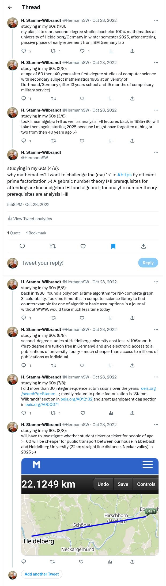

# studying in my 60s

Twitter blocked access for users without an accout on 7/1/2023.  

Time to copy out my thread regarding "studying in my 60s":  
(with Firefox full page screenshot and netpbm pnmcut)  

Original tweet (4/8) on "why mathematics?" is the highlighted one:  
https://twitter.com/HermannSW/status/1586024568434692097  

The three links from (7/8) tweet:  
https://oeis.org/search?q=Stamm-Wilbrandt&sort=modified  
https://oeis.org/A012132  
https://oeis.org/A000071  

